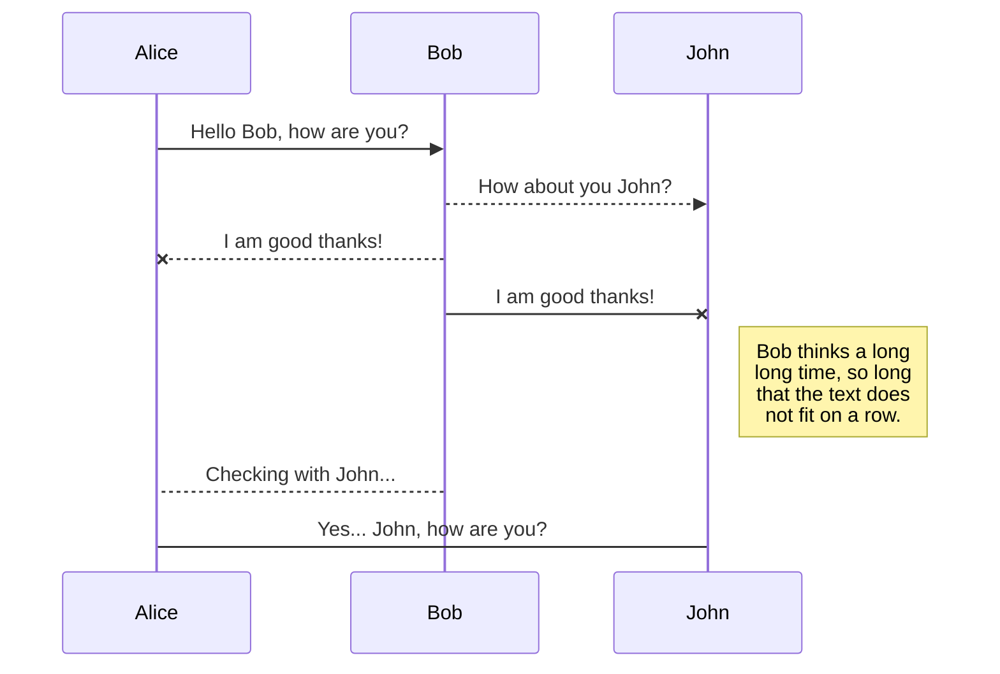
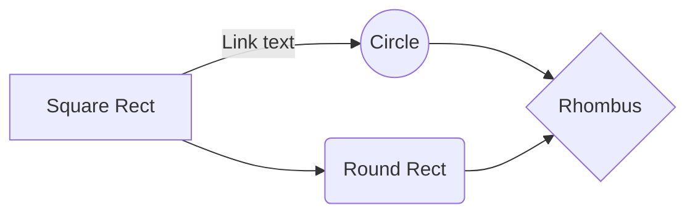

# Getting Set Up To Work On The DBP Codebase!

This page is here to help you work in the DBP codebase, our project is open source so they sky is your limit!
Starting from working on the DBP or customizing your own version, this is the place to start from.
So if you’d like to help **DBP community** build the coolest devops app, you’re in the right place.

We make changes to DBP by writing patches, testing, revewiging them and pushing them. Here is a small checklist to help you get started:

-   ## Before you start:
    -   #### What skills do I need?
        -   list?
    -   #### Account needed? (just github or need to register for other services?)
    -   #### Any special code review tools to install?
    -   #### Dependencies to install? (Extensions, ..etc.)
    -   #### Speceific OS dependices? (Windows, linux, ..) -c
    -
-   ## Cloning Our Codebase:
    -   Coding commands
        `git clone ....`
        -   Setup on Windows
            -   `...`
        -   Setup on Mac and Linux
            -   `....`
        -   Write a patch
            -   `....`
        -   Commit Message:
            -   `....`
        -   To make sure the change follows the coding style:
            -   `....`
        -   To test a change locally
            -   `....`
        -   To test a change remotly
            -   `...`
        -   To submit a patch
            -   `...`
        -   To update the working directory
            -   `...`
        -   To update a submitted patch
            -   `...`
        -   Retrieve new changes from the repository
            -   `...`
        -   To push a change in the code base
            -   `...`
-   ## More documentation about contribution:
    -   List of links?

# Finding Something To Work on

text

## Bugs We Identified?

-   list

## Fixing Bugs

..........

## Getting your code reviewed

............

## Following up and responding?

    ...what to expect, time estimation,..etc.

## Getting Code pushed into DBP

.........

# More Information:

-   Getting to learn the DBP Codebase - ...............
    -Guides to tools we used?

## Code Quality

... list of standards for code style, linting,...etc.

## Defintion of Done.

... what' acceptable to be finished code.

## How to Identify A bug

..bug,..bug definition, severity, list of old bugs,...etc.

type of bug (fix, enhancement, ...etc.)

All your files and folders are presented as a tree in the file explorer. You can switch from one to another by clicking a file in the tree.

## Bug Handling

-   Bug pipeline => .....
-   Bug Types => .....
-   Other Bug Metadata => .....
-   Priority Definitions => .....
-   Defect Severity => .....
-   Release Status Flags => .....

## Rename a file

You can rename the current file by clicking the file name in the navigation bar or by clicking the **Rename** button in the file explorer.

## Delete a file

You can delete the current file by clicking the **Remove** button in the file explorer. The file will be moved into the **Trash** folder and automatically deleted after 7 days of inactivity.

## Export a file

You can export the current file by clicking **Export to disk** in the menu. You can choose to export the file as plain Markdown, as HTML using a Handlebars template or as a PDF.

## UML diagrams

You can render UML diagrams using [Mermaid](https://mermaidjs.github.io/). For example, this will produce a sequence diagram:

And this will produce a flow chart:

