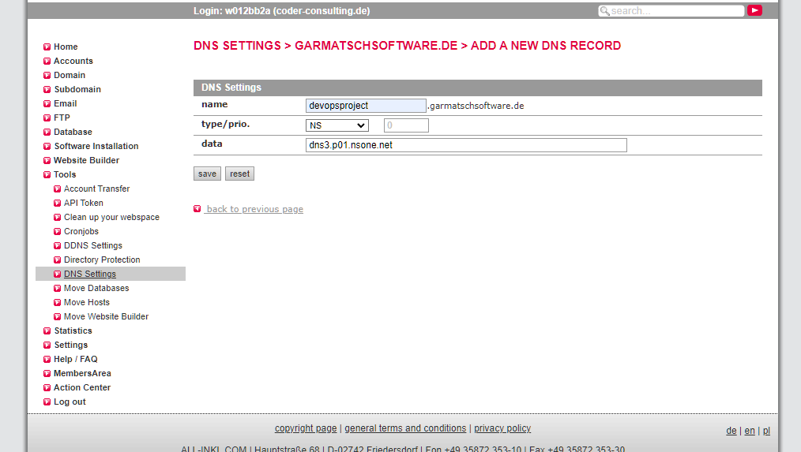

### Tasks

  - Setup + Guideline (for all platforms use Max's or GS's accounts NOT personal accounts)
  1. Deploy the website to netlify (connect Max's GitHub repo to netlify)
  2. Add a custom domain,  "garmatschsoftware.de or     devopsproject.garmatschsoftware.de"
  3. Update DNS settings on all-inkl
      - <https://kas.all-inkl.com/index.php>
      - login via bitwarden: w012bb2a
  4. Select DOMAIN from the left-side menu
  5. Navigate to garmatschsoftware.de > select the Edit icon on the right
  6. DNS settings for this subdomain
  7. Create New DNS
  8. Select NS
  9. Add "devopsproject" in the name Field
  10. Add DNS from netlify in the data field
  11. do it for the 4 DNS provided.
  12. Click save

  

**Once The deployment is done and devopsproject.garmatschsoftware.de leads to the current webpage.**
**Link it to Cloudflare and AWS for CDN management: [guid here](https://dev.to/joelnet/how-i-setup-my-own-personal-cdn-3h06)**

  - Connect Domain to Cloudflare
  - using a free plan
    - [Cloudflare plans](https://www.cloudflare.com/en-gb/plans/)
  - Connect it to the AWS S3 bucket for static content (login via bitwarden: max.g@garmatschsoftware.de)
  - <https://aws.amazon.com/s3/> ( can use free  plan 5 GB for 12 months)

13. Usage Examples
    .PNG
    .PDF
    .mp3
    .m4a or mp4
14. Deploy to live and have a link to test
