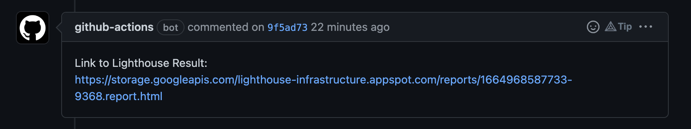

 ### Setup Lighthouse on Github Action
1. new YAML file, `.github/workflows/ligthouse.yml`

        name: LightHouse
        on: [push]
        jobs:
          lighouthouse-test:
            name: Lighthouse
            runs-on: ubuntu-latest
            steps:
              - uses: actions/checkout@v2
              - name: Use Node.js 14
                uses: actions/setup-node@v1
                with:
                  node-version: 14
              - name: Install and Run Lighthouse CI
                run: |
                  npm install -g @lhci/cli@0.8.x
                  lhci autorun --upload.target=temporary-public-storage

2. Create PR-Comment, containing Link to Lighthouse result

        name: LightHouse
        on: [push]
        jobs:
          lighouthouse-test:
            name: Lighthouse
            runs-on: ubuntu-latest
            steps:
              - uses: actions/checkout@v2
              - name: Use Node.js 14
                uses: actions/setup-node@v1
                with:
                  node-version: 14
              - name: Install and Run Lighthouse CI
                run: |
                  npm install -g @lhci/cli@0.8.x
                  echo "LIGHTHOUSE_URL=$(lhci autorun --upload.target=temporary-public-storage | grep -o "https://storage.*html")" >> $GITHUB_ENV
              - name: Comment Lighthouse Result
                uses: zt4ff/auto-commenter@v2
                with:
                  type: custom
                  body: |
                    Link to Lighthouse Result:
                    ${{ env.LIGHTHOUSE_URL }}

### Docs
  - Lighthouse config:
   https://github.com/GoogleChrome/lighthouse-ci/blob/main/docs/configuration.md
  - Getting started with lhci (lighthouse-ci): 
  https://github.com/GoogleChrome/lighthouse-ci/blob/main/docs/getting-started.md
  - Assertions:
   https://github.com/GoogleChrome/lighthouse-ci/blob/main/docs/getting-started.md#add-assertions

   - comment example:
   