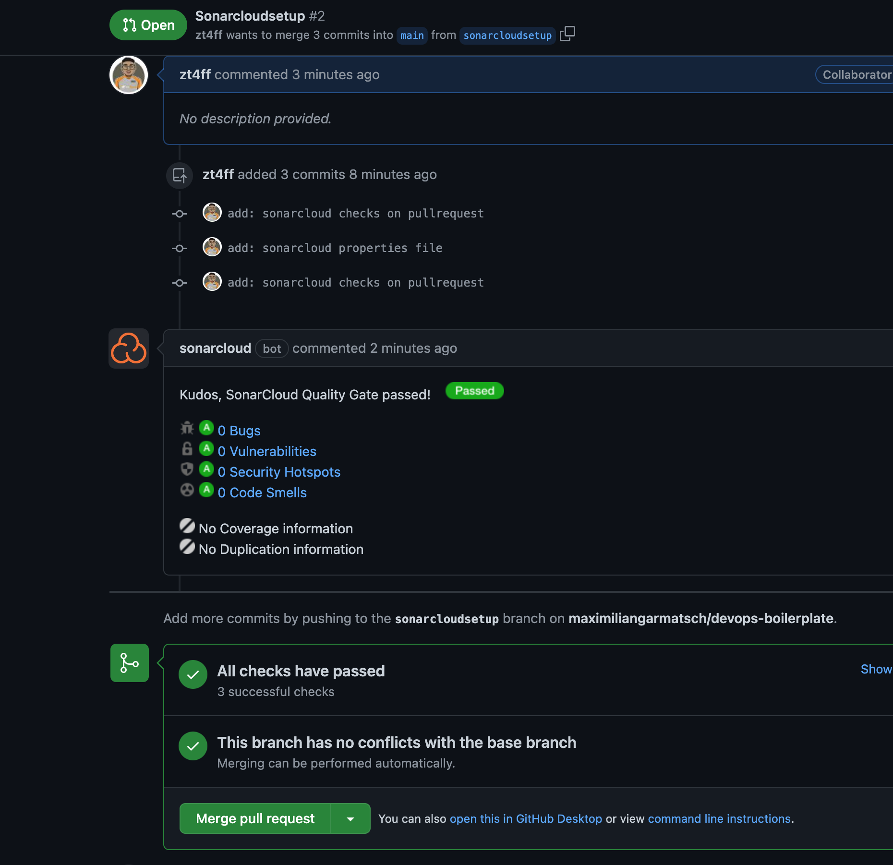

### Steps

1. Login into SonarCloud with GitHub and give access to GitHub-Repo - <https://sonarcloud.io/>
2. Create action-secret
    - <https://github.com/maximiliangarmatsch/devops-boilerplate/settings/secrets/actions>
    - called `SONAR_TOKEN`  with the string provided by SonarCloud
3. Create  `.github/workflows/sonarcloud.yml`   and paste the following
    - example: <https://github.com/maximiliangarmatsch/devops-boilerplate/blob/main/.github/workflows/sonarcloud.yml>
4. Configuration file: ./sonar-project.properties
    - example: <https://github.com/SonarSource/sonar-scanning-examples/blob/master/sonarqube-scanner/sonar-project.properties>
  
### Why

- Run SonarCloud checks whenever a pull request is made to the main branch.

### Example (will become outdated)

- <https://sonarcloud.io/project/pull_requests_list?id=maximiliangarmatsch_devops-boilerplate>
